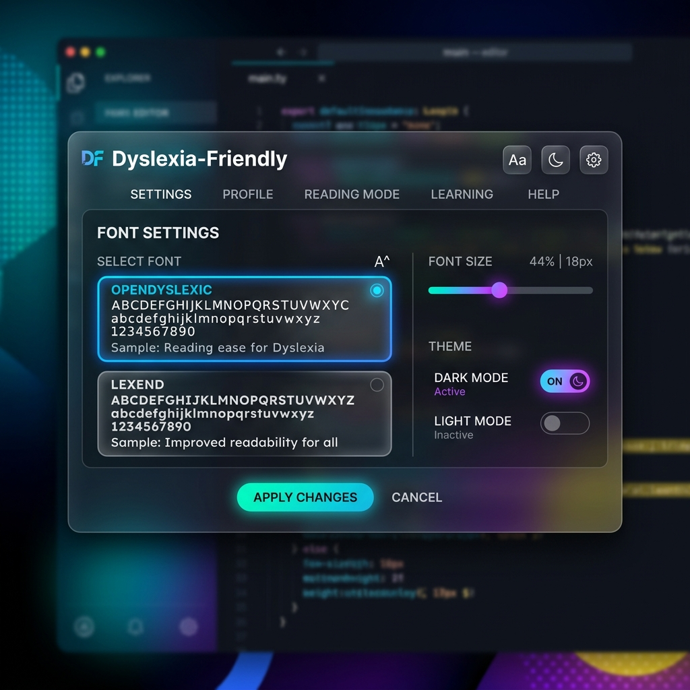
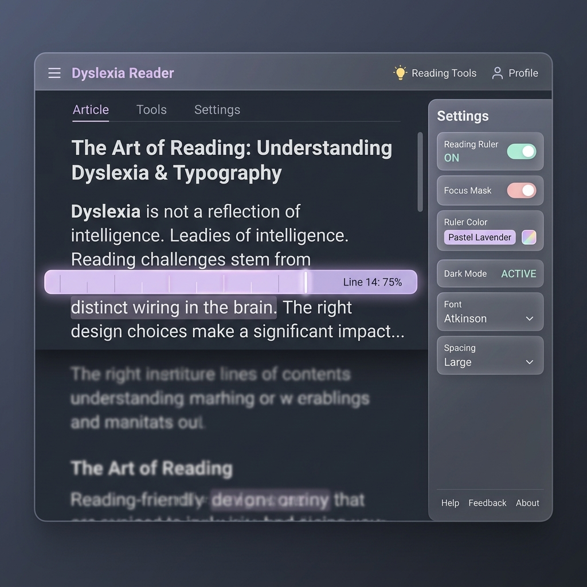
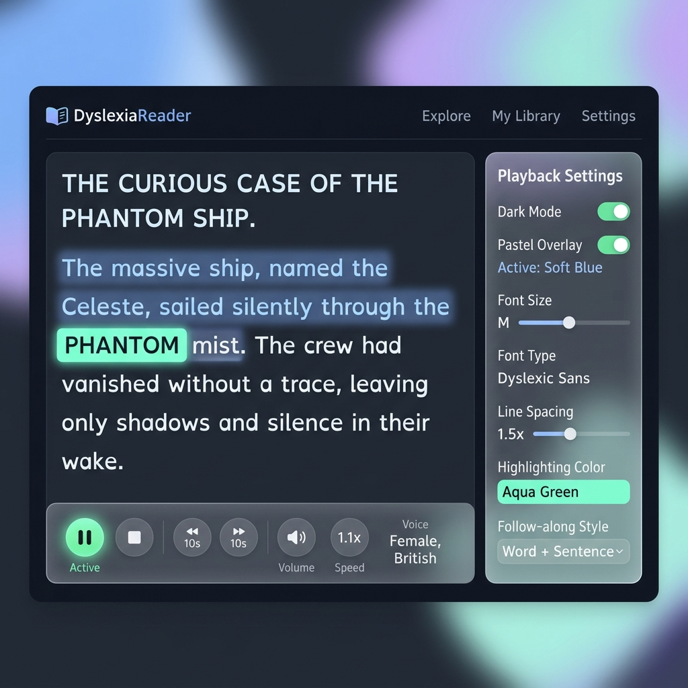
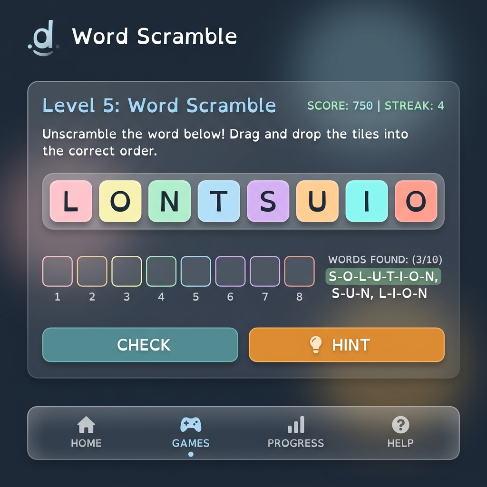

# Dyslexia‑Friendly Web App

## Overview
A premium, interactive web application designed to make reading and learning more accessible for individuals with dyslexia. Features include:
- **Dynamic font options** – OpenDyslexic, Lexend, and customizable fonts.
- **Custom color contrast** – Choose pastel overlays or define your own background and text colours.
- **Reading ruler & focus mask** – Highlight specific lines while you read.
- **Text‑to‑speech with follow‑along highlighting** – Real‑time word highlights as the browser speaks.
- **Bionic reading** – Emphasizes the first few letters of each word to improve focus.
- **Word inspector** – Click any word for definitions and pronunciation.
- **PDF viewer** – Accessible PDF reading with the same tools.
- **Accessible Notepad & Playground** – Edit or read mode with voice typing, TTS, and interactive word inspection.
- **Phonics games** – Word Builder, Letter Flipper, and the new **Word Scramble** game to practice spelling.

## Demo
Below is a quick visual tour of the app. Hover over the images for a preview of the interaction.









## Getting Started
```bash
# Clone the repository (if you haven't already)
git clone https://github.com/mennatallahessam/Dyslexia-Friendly-app.git
cd Dyslexia-Friendly-app

# Install dependencies
npm install

# Run the development server
npm run dev
```
Open `http://localhost:5173` in your browser.

## Contributing
Contributions are welcome! Feel free to open issues or submit pull requests to add more accessibility tools or polish the UI.

---
*Built with Vue 3, Vite, and a strong focus on modern UI aesthetics.*
